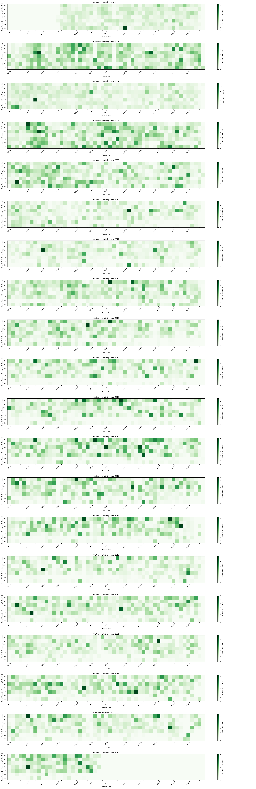

# gitAnalysis

gitAnalysis is a Python tool for analyzing Git commit activity and visualizing it in a contribution graph format similar to GitHub.

## Features

- Retrieve Git commit activity from a local repository.
- Visualize commit activity in a contribution graph format.
- Separate diagrams for each year to analyze long-term trends.
- Customizable with different color schemes and visualization options.

## Installation

1. Clone the repository:

   ```bash
   git clone https://github.com/Ian729/gitAnalysis.git
   cd gitAnalysis
   ```

2. Create virtual env:

    ```
    python3 -m venv venv
    source venv/bin/activate
    pip install -r requirements.txt
    ```

3. Modify repo_path in git_analysis.py
    ```
    repo_path = '~/your_repo_path'  # Replace with your repository path
    ```

## Example
This is a generated diagram for `git/git`
